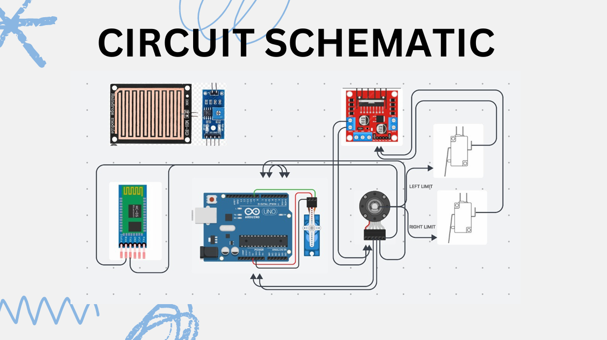
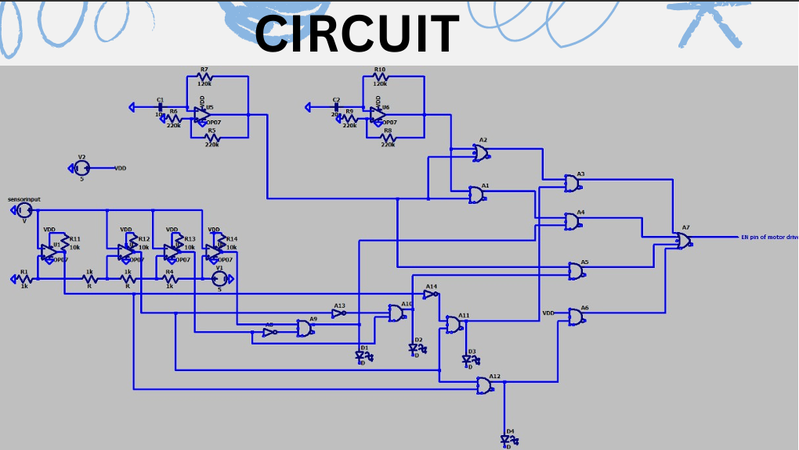
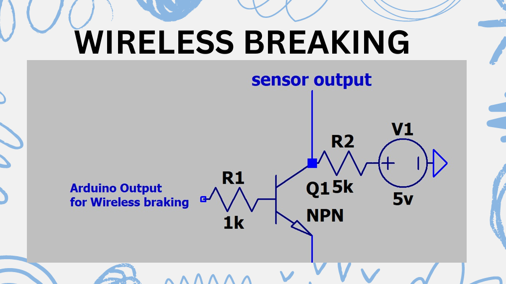

# 🌧️ Automatic Windshield Wiper System (KRITI’25 Project)

This project implements a fully analog **automatic windshield wiper** system capable of detecting rain intensity and dynamically adjusting the wiper speed accordingly. It was developed as part of **KRITI’25**, the Inter-Hostel Technical Competition at IIT Guwahati.

## 🧠 Project Highlights

- **Rain Intensity Detection** using a raindrop sensor module.
- **PWM Wave Generation** via Op-Amp based RC oscillator and logic gates (AND, OR) to derive 25%, 50%, and 75% duty cycles.
- **Comparator Circuit** to classify rain levels into four categories and trigger appropriate motor speed control.
- **DC Motor Speed Control** using motor driver enable pin regulated by PWM, with **direction control** achieved via **JK Flip-Flop + Limit Switches**.
- **Needle Speedometer**: Real-time visual feedback using a servo motor and Arduino, driven by motor encoder.
- **Wireless Emergency Braking** via a transistor switch circuit connected to Arduino.

## ⚙️ Components Used

- Op-Amps (for oscillator and comparators)
- Logic gates (AND, OR)
- Raindrop sensor
- Motor driver
- DC Motor
- Limit Switches
- JK Flip-Flop
- Servo motor
- Arduino
- Encoder
- Transistors & LEDs

## 📂 Repository Contents

- `90_rain_rain_go_away_report.pdf`: Complete circuit flow, design explanation, and block diagrams.
- `90_rain_rain_go_away_arduinocode.ino`: Arduino code for servo-based needle speedometer and wireless braking control.

## 📷 Preview

Here are some snapshots of the project implementation:

  
*Circuit Schematic*

  
*Circuit generated in LT Spice*

  
*Wireless Braking Circuit Setup*

## 🛠️ Built With

- Pure analog logic for control signals
- Arduino (for servo motor + wireless integration)
- C++ (Arduino IDE)

## 🏁 Future Improvements

- Full microcontroller integration
- Real-time LCD feedback or mobile dashboard
- Rain intensity graphing using ADC and timestamping
